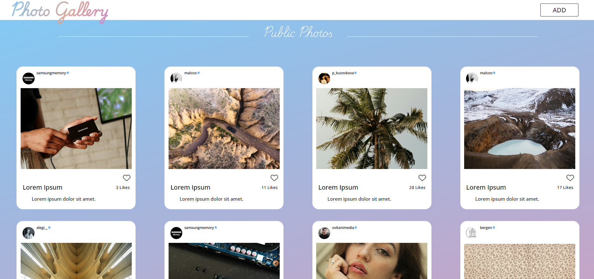

# Photo Gallery Application

## Website is Live At:

[Photo Gallery](https://mena-saleh.github.io/Photo-Gallery/)

## Table of Contents

1. [Project Description](#project-description)
2. [Usage](#usage)
3. [Dependencies and Setup](#dependencies-and-setup)
4. [Functionality](#functionality)
5. [Acknowledgements](#acknowledgements)

## Project Description

This project is a photo gallery application featuring two albums: a public album with photos retrieved from the Unsplash API, and a local album with photos saved in the user's local storage.

    

## Usage

Users can view public photos and see details such as the owner's username, description (if available from Unsplash), photo name (not provided by Unsplash), and number of likes. Liking a photo is a visual feature only and does not register with Unsplash.

For the local album, users can add photos via the add-photo page. Due to storage limitations (photos are saved as data URLs), it is recommended to keep photo uploads under 5MB. The provided "Thumbnails" folder contains sample images. Users can delete photos from local storage by clicking the trash icon and confirming the action.

## Dependencies and Setup

This project requires only a web browser that supports HTML, CSS, and JavaScript (e.g., Google Chrome). No special software or installation is needed. Simply open the `index.html` file in any supported browser.

### Included Files and Folders:

- `index.html`
- `add-photo.html`
- `CSS/main.css`
- `JS/script.js`
- `Images` (folder with app Icon and static local user profile image)
- `Thumbnails` (folder with sample images)
- `lib` (folder with js libraries such as toastr and jquery)
- `README.md`

### How to Run the Project:

Navigate to the project folder and double-click the `index.html` file. The project should open immediately in your default web browser.

### Technologies Used:

- HTML5
- CSS3
- JavaScript ES6
- JS libraries (Toastr, SweetAlert2)

## Functionality

### Randomized Photos Feed

On each home page refresh, a random feed of 10 photos is loaded using the Unsplash API. The photo names are currently set to "Lorem Ipsum" as the API does not provide names. Users can like photos, but this is only a visual feature and not registered with Unsplash.

### Local Photos Feed

Users can upload photos to the local album, stored in local storage (up to 5MB). Validation ensures that required fields are filled, and errors are displayed if not. Photos can be deleted, and deletion is permanent. Local photos persist across sessions.

## Acknowledgements

### About the Author

- **Name**: Mena Ashraf Mikhael Saleh
- **Email**: [Mena.a.saleh.2001@gmail.com](mailto:Mena.a.saleh.2001@gmail.com)
- **GitHub**: [https://github.com/Mena-Saleh](https://github.com/Mena-Saleh)
- **LinkedIn**: [https://www.linkedin.com/in/mena-ashraf-23b947167/](https://www.linkedin.com/in/mena-ashraf-23b947167/)
